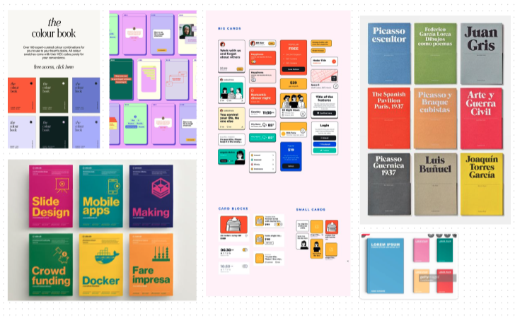
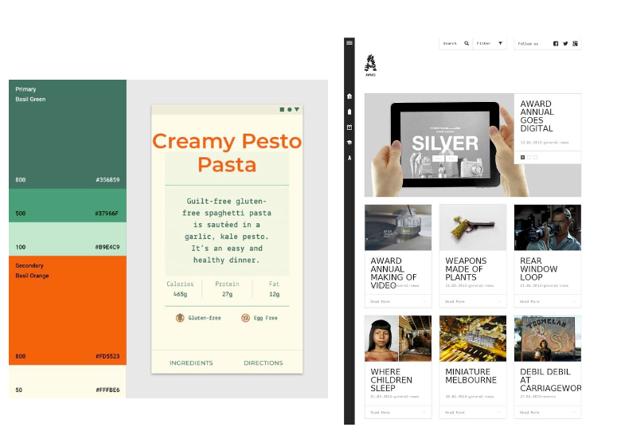
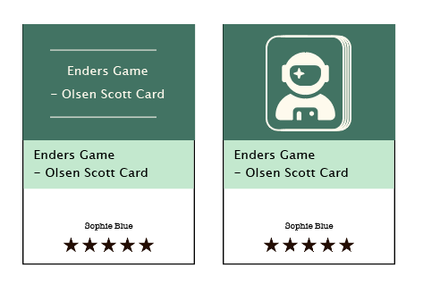
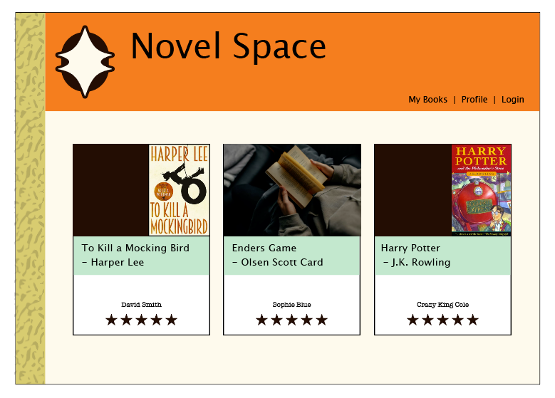
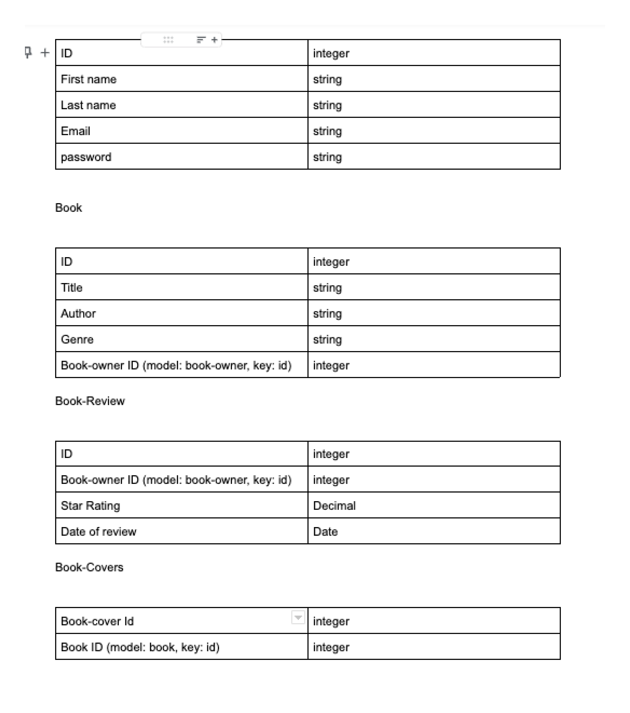
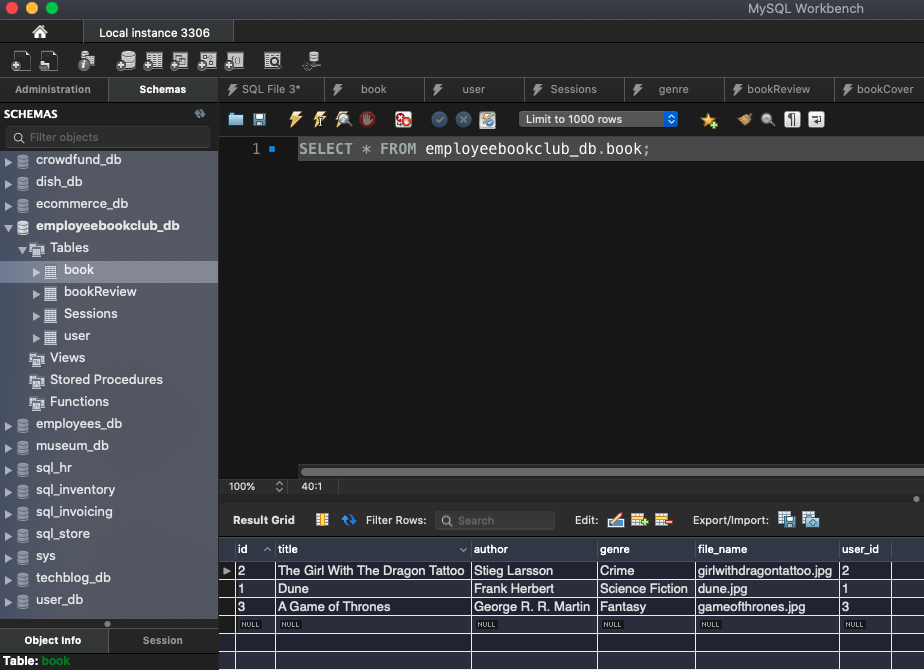

# Novel Space - A communal book shelf for your workplace

Novel Space is an application for the book lovers at your work place. Simply, it's a shared digital book shelf. Each book lover can place the books they own and recommend on the 'shelf' and others 
Novel Space is an application for the book lovers at your work place. Simply, it's a shared digital book shelf. Each book lover can place the books they own and recommend on the 'shelf' and others

This application is different from [Goodreads](https://goodreads.com/) as it isn't a global

## Team members

[Lachlan](https://github.com/lconnell1000)

[Dave](https://github.com/SEO-Web)

[Clayton](https://github.com/ClaytonMcIntosh)

## Elevator pitch


## User Story
```
AS A book lover in a large workplace
I WANT a communal digital bookcase
SO THAT I can share my love of books with my work colleges
```

## Acceptance Criteria
```
GIVEN a 
WHEN I 
THEN I 
```


## Deployment on Heroku

[Novel Shelf on Heroku](https://)

## Development


## Tools

[Figjam](https://www.figma.com/)

[Unsplash](https://unsplash.com/photos/IOzk8YKDhYg)

[Insomnia](https://insomnia.rest/)

[Node.js](https://nodejs.org/en/)

## Inspiration

[Molly Dooker](https://mollydookerwines.com.au/shop-wines/)


## Packages

[Express](http://expressjs.com/)
[Sequalize](https://sequelize.org/)
[Bcrypt](https://www.npmjs.com/package/bcrypt)
[Mysql](https://www.npmjs.com/package/mysql2)
[Handlebars](https://handlebarsjs.com/)


*Use at least one new library, package, or technology that we haven’t discussed.*


Unable to get Formidale to work.

[Formidable](https://www.npmjs.com/package/formidable)

Switched to Multer

[Multer](https://www.npmjs.com/package/multer)









