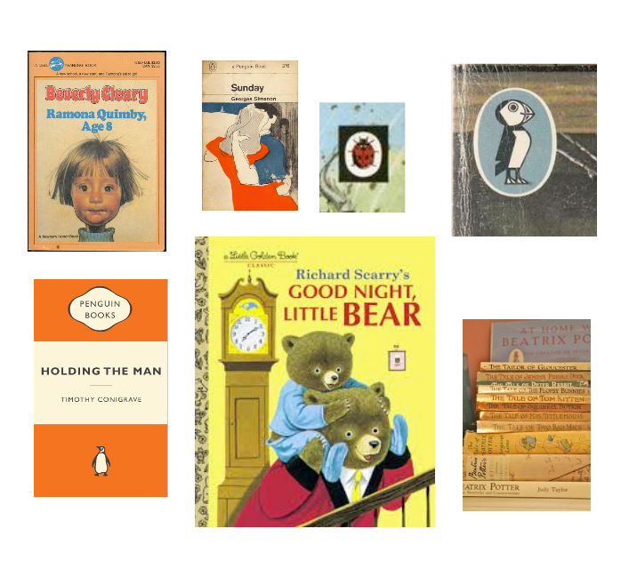

# Novel Space - A communal book shelf for your workplace

Novel Space is an application for the book lovers at your work place. Simply, it's a shared digital book shelf. Each book lover can place the books they own and recommend on the 'shelf' for others in their workplace to view. This application is different from [Goodreads](https://goodreads.com/) as it's only shared with people you know, and not anyone in the entire world.

## Team members

[Lachlan](https://github.com/lconnell1000)

[Dave](https://github.com/SEO-Web)

[Clayton](https://github.com/ClaytonMcIntosh)

## Elevator pitch

Novel Space is a shared book shelf for the book lovers in your community.

## User Story
```
AS A book lover in a large workplace
I WANT a communal digital bookcase
SO THAT I can share my love of books with my work colleges
```

## Acceptance Criteria
```
GIVEN a book lovers website
WHEN I visit the site for the first time
THEN I am presented with the homepage with any publicly viewable books
WHEN I click on any links while I am not logged in
THEN I am taken to a log in or sign-up form
WHEN I fill in the form with the correct information
THEN I am logged into the website
WHEN I am logged in
THEN I am presented with my own books and an option to upload new books
WHEN I click on add a new book
THEN I can add a book with a title, author and genre
WHEN I when I add a book
THEN I see it displayed on my profile with a delete button
WHEN I click delete on my own books
THEN the book is deleted
WHEN I click add review
THEN I am able to add a review with a star rating
WHEN I click log out
THEN I am logged out of the website
```

## Deployment on Heroku

[Novel Shelf on Heroku](https://)

## Development

This project was developed in just under two weeks and had a few problems, including technical problems, disruption from work schedules and covid! However, we were able to pull through and create a fully functional website using many tools, technologies and collaboration techniques. 

## Inspiration

We took inspiration from the topic at hand - books! However, we also had to take into account the practicality of displaying the books in cards on the website. First we did a bit of research and came up with some design ideas.




This led to the idea of having a book nostalgia theme, and a mock-up of a design possibility.


We then looked into other sites, and how they were creating similar pages.


Finally, we found [Molly Dooker](https://mollydookerwines.com.au/shop-wines/) which was a site we all liked and we drew inspiration from the colour scheme, and the layout. We then moved forward with creating the website.

## Tools

We use [Figjam](https://www.figma.com/) as a pinboard to share information and keep us on track. We pasted text and pictures so they were easily accessible by the whole team. For example, here is the databases conceptualized before we created it.


We used [Unsplash](https://unsplash.com/photos/IOzk8YKDhYg) for stock photos as it's free.

The application was created with [Node.js](https://nodejs.org/en/), and we used [Insomnia](https://insomnia.rest/) to test our API calls, and [MySQL Workbench](https://www.mysql.com/products/workbench/) to test the databases.


### NPM Packages

- [Express](http://expressjs.com/)
- [Sequalize](https://sequelize.org/)
- [Bcrypt](https://www.npmjs.com/package/bcrypt)
- [Mysql](https://www.npmjs.com/package/mysql2)
- [Handlebars](https://handlebarsjs.com/)

Unfortunatly, we had some major issues trying to get the uploads to work with the packages we used. We tried [Formidable](https://www.npmjs.com/package/formidable), and switched to [Multer](https://www.npmjs.com/package/multer) but unfortunatly couldn't get either to work in our forms.

## Final screenshot of application in development


## Deployment on Heroku

[Novel Shelf on Heroku](https://)